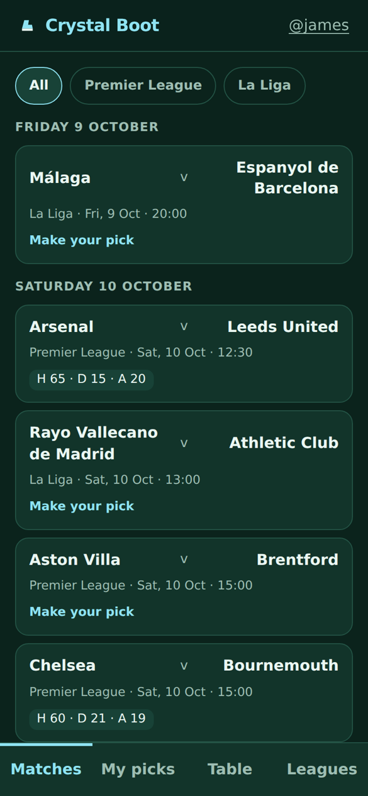
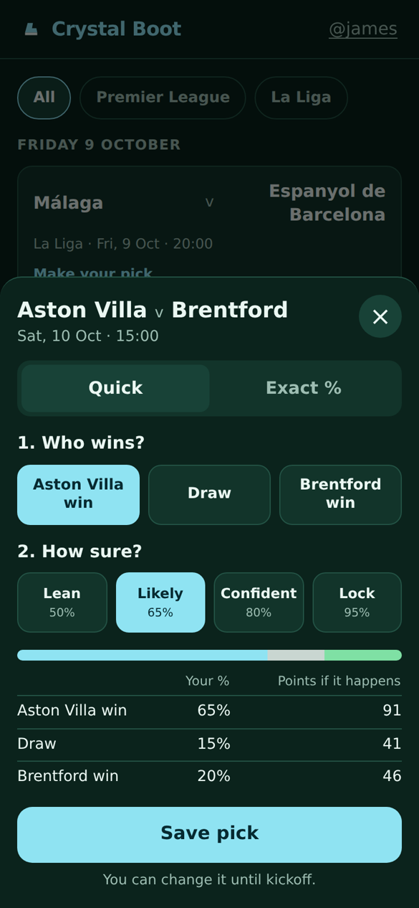
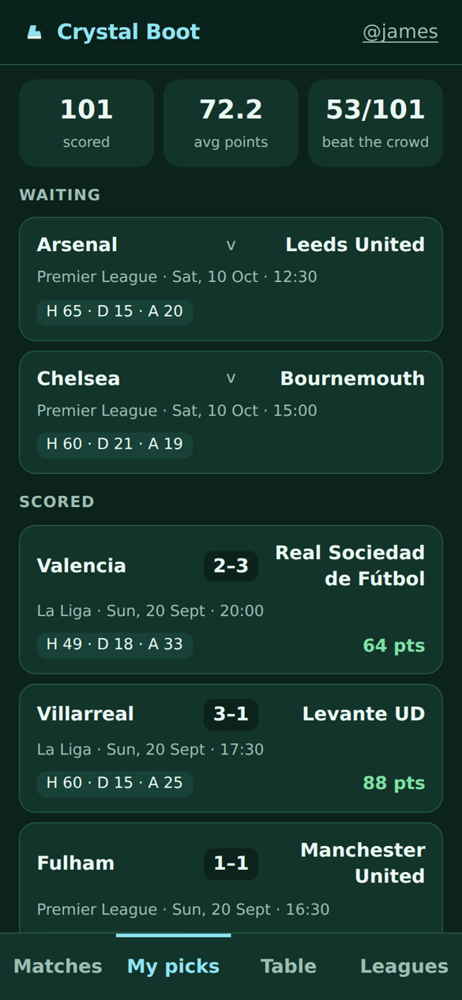
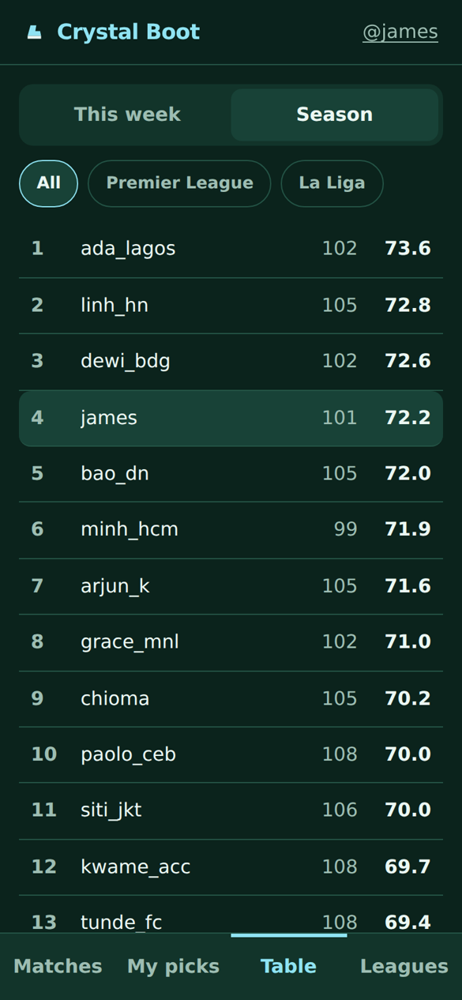
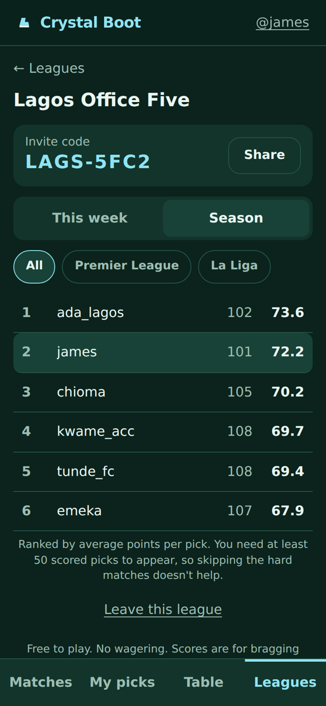

# Crystal Boot

[](https://github.com/jnbowmar/crystal-boot/actions/workflows/test.yml)

A free football forecasting league for the Pi Browser. For each Premier League and La Liga match you give a probability for a home win, a draw and an away win. After full time you're scored on how close you were. You can see whether you beat the crowd, and climb the global table and private leagues with your friends.

It's free to play and there's no wagering. Pi pays only for extras that have nothing to do with results. Today that's creating a private league. Pi never pays out on a match.

Built for the monthly #PiHackathon, targeting November 2026. The full design is in [SPEC.md](SPEC.md).

<p>
  
  
  
  
  
</p>

<sub>Screenshots from a local build with made-up demo players (`npm run demo:seed`) on real 2026-27 fixtures and results.</sub>

## How it uses Pi

- **Pi sign-in only.** Players are verified Pi users, so one person gets one account, which is the usual way prediction games get cheated. The server checks every sign-in against Pi's `/v2/me`.
- **Pi payments for extras, never for outcomes.** Starting a private league is a one-off user-to-app payment. Pi goes in only for things unrelated to how a match turns out, and nothing is ever paid out on results. This follows the Pi App Studio rule against "gambling, betting, or lottery-related services involving Pi tokens, either directly or indirectly".
- **Built for Pi's rules:** prices are in Pi only (no dollar values anywhere), there are no links out of the app, no email or other sign-in, and minimal data (Pi uid and username, picks and leagues).
- **Built for Pi's audience:** football is the biggest sport in Nigeria, Vietnam, the Philippines, Indonesia and India. The app is designed for a 375px phone, shows kickoff times in your own timezone, and needs only two taps per pick.

## How scoring works

A pick is three whole percentages that add up to 100, like `{H: 65, D: 15, A: 20}`. The two-tap version picks an outcome and a confidence level (50, 65, 80 or 95%), then splits what's left between the other two outcomes by the league's historical base rates.

Each pick gets a three-outcome Brier score, which runs from 0 (perfect) to 2 (a 100% pick on the wrong result). Players see it as points:

```
points = round(100 - 50 × brier)
```

For Arsenal 3-0 Coventry:

| Pick (H/D/A) | Brier | Points |
|---|---|---|
| 95 / 2 / 3 | 0.0038 | 100 |
| 33 / 33 / 34 | 0.6734 | 66 |
| 5 / 15 / 80 | 1.565 | 22 |

A confident wrong pick costs the most, so calibration beats bravado. Leaderboards rank by average points with a minimum pick count, so skipping the hard matches doesn't help.

A small detail I liked: with whole percentages the raw score can never land on exactly .5, so rounding is never a judgment call. The proof is a comment in [`scoring.ts`](src/scoring/scoring.ts), and a test checks every possible pick.

## Base rates

From five finished seasons (2021-22 to 2025-26) of [openfootball](https://github.com/openfootball/football.json) data:

| League | Matches | Home | Draw | Away |
|---|---|---|---|---|
| Premier League | 1,900 | 44.2% | 23.9% | 31.9% |
| La Liga | 1,890 | 45.8% | 26.1% | 28.1% |

Reproduce with `python3 m0/base_rates.py`.

## The app

A React app (Vite + TypeScript) in [`web/`](web/), built for a 375px phone screen in the Pi Browser. You make a pick in two taps: choose Home, Draw or Away, then how sure you are. There's also an exact-percentage mode with three linked sliders. Before you save, it shows how many points you'd get for each result. Kickoff times show in your own timezone. It imports the same `scoring.ts` as the Worker, so its preview can't disagree with how a pick is actually scored.

Sign-in is Pi only. The app calls `Pi.authenticate(['username', 'payments'])` and sends the access token to `POST /api/auth`. The Worker checks it against Pi's `/v2/me`, which is the source of truth, and returns its own 30-day session token. Only a SHA-256 hash of that token is stored.

## Private leagues and Pi payments

Anyone can start a private league for a one-off Pi payment (0.5 testnet Pi for now, set by `LEAGUE_PRICE_PI`) and invite friends with an 8-character code or a `/?join=CODE` link. Joining is free. A league table is the main table filtered to its members, so everyone's picks count everywhere. Pi only ever goes in; nothing is paid out on results.

Payments follow Pi's three-phase flow, in [`src/worker/payments.ts`](src/worker/payments.ts):

1. The app asks for an order (`POST /api/leagues/order`), then calls `Pi.createPayment` with the order id in the metadata.
2. `onReadyForServerApproval` → `POST /api/payments/approve`. The Worker reads the payment from Pi with the Server API Key and checks it against the order: same user, same order, same amount, user-to-app, right network. Then it binds the payment to the order and approves it with Pi.
3. The user signs. `onReadyForServerCompletion` → `POST /api/payments/complete`. The Worker calls Pi's `/complete`. It creates the league only when Pi's own record shows the payment developer-completed with a verified transaction and a matching txid.

The client is never trusted about money. Approve and complete are idempotent because the SDK retries them. A cancel is honoured only while there's no transaction. A payment the user signed but never completed (the app closed mid-flow) comes back through `onIncompletePaymentFound` at the next sign-in and gets finished then (`POST /api/payments/incomplete`).

## The backend

A Cloudflare Worker with a D1 (SQLite) database, in [`src/worker/`](src/worker/). It also serves the built app as static files, with `/api/*` going to the Worker. Every 6 hours a cron job pulls the openfootball feeds, upserts matches, settles the ones that have a score and scores their picks. Each step is a single SQL statement, so a run takes a handful of D1 queries however many picks there are.

| Route | What |
|---|---|
| `POST /api/auth` | `{accessToken}` from `Pi.authenticate` → session token |
| `GET /api/matches?league=en.1&from=&to=` | Fixtures with status, result, crowd forecast and your pick |
| `POST /api/picks` | `{matchId, pick: {H, D, A}}` or two-tap `{matchId, outcome, confidence}`. Refused from kickoff on |
| `GET /api/picks` | Your picks and points |
| `GET /api/leaderboard?league=all&period=week\|season&date=&scope=global\|league:<id>` | Average points, minimum pick count applies, plus your own line. League scope is members only |
| `GET /api/leagues`, `POST /api/leagues/join`, `POST /api/leagues/leave` | Your leagues; join with a code (free); leave |
| `GET /api/leagues/preview?code=` | A league's name and size, before joining |
| `POST /api/leagues/order` | `{name}` → the order to pay for with `Pi.createPayment` |
| `POST /api/payments/approve`, `complete`, `cancel`, `incomplete` | The Pi payment callbacks (see above) |
| `POST /api/admin/sync`, `POST /api/admin/score` | Run the cron now; enter a result by hand (bearer `ADMIN_TOKEN`) |

With `FAKE_USERS=1`, an `X-Fake-User: <name>` header works in place of Pi sign-in, and the sign-in screen offers a test-player box. It's `"0"` in `wrangler.jsonc`, so deploys only accept Pi sign-in; local dev turns it on in `.dev.vars`.

Run it locally:

```bash
printf 'ADMIN_TOKEN=dev-admin\nFAKE_USERS=1\n' > .dev.vars   # local only; test players on
npm run db:migrate:local
npm run dev                                   # builds the app, serves everything on http://localhost:8787
curl -X POST "localhost:8787/cdn-cgi/handler/scheduled?cron=0+*/6+*+*+*"   # run the cron once
```

For live reload while working on the app, also run `npm run dev:web` (Vite on :5173, proxying `/api` to :8787).

To fill a local database with made-up players, picks on the real results so far and a private league (for demos and screenshots), run `npm run demo:seed` after the first cron run. It's for the local database only.

To deploy: `npx wrangler d1 create crystal-boot`, put the id in `wrangler.jsonc`, then `npm run db:migrate:remote`, `npx wrangler secret put ADMIN_TOKEN`, `npx wrangler secret put PI_API_KEY` (from the Pi Developer Portal) and `npm run deploy`. To try it in the Pi sandbox, open `develop.pi` in the Pi Browser, register the app, set its development URL to the deployed Worker, and open the sandbox URL the portal gives you (see [Pi's docs](https://github.com/pi-apps/pi-platform-docs)).

## Run the tests

```bash
npm install
npm test
```

The app tests render the real React app on jsdom, wired straight into the Worker's handler and SQL, with only Pi stubbed. They cover sign-in, a two-tap pick, an exact pick, locking at kickoff, an expired session and test players.

The payment tests run the whole approve → sign → complete loop against `FakePi` (`src/worker/testing/fakePi.ts`), a stateful stand-in for Pi's API that enforces Pi's rules. They cover cancels, SDK retries, a Pi outage mid-completion, an unverified transaction, an unfinished payment resumed at sign-in, and the ways a tampered client could try to cheat: wrong amount, someone else's order, a made-up txid, the wrong network, and two payments for one order. In every one, no league is delivered unless Pi confirms.

The Worker tests run the real SQL and migrations on `node:sqlite`, against snapshots of the live 2026-27 feeds. They replay the weekend of 18-20 September: a dozen fake players pick all 20 matches, then the next sync settles them, and every pick's points, every crowd forecast and the weekly leaderboard must match `scoring.ts` exactly. Another test checks the SQL points formula against `points()` for every possible pick.

The suite also includes a 693-case parity check against the Python Brier function I already use to score my own Fed forecasts. `scripts/parity.py` generated the fixture in `src/scoring/__fixtures__/`. It reads that private scorer, so the committed fixture is what CI checks against.

## Status

| Milestone | What | State |
|---|---|---|
| M0 | Base rates and kickoff timezones from openfootball | done |
| M1 | Scoring module and tests | done |
| M2 | Cloudflare Worker, D1 database, scheduled settlement | done (runs locally; not deployed yet) |
| M3 | React pick flow and Pi sign-in in the Pi Browser | built; waiting on a Pi sandbox test |
| M4 | Private leagues paid in testnet Pi | built; waiting on a Pi sandbox test |
| M5 | Hackathon submission | in progress: see [docs/SUBMISSION.md](docs/SUBMISSION.md) |

## Data

Fixtures and results come from [openfootball/football.json](https://github.com/openfootball/football.json), which is public domain (CC0). The app shows team names only, since crests, photos and player data are licensed.

## License

MIT
